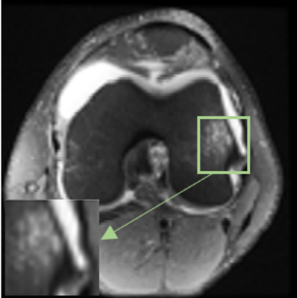
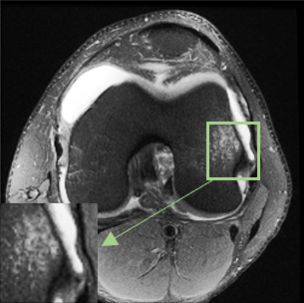
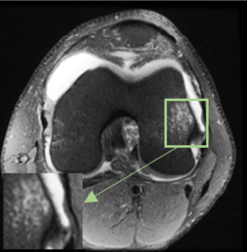

# 🧠 Reconstrucción de Imágenes MRI mediante Super-Resolución Profunda (RBSRCNN)


Este proyecto implementa un **framework de entrenamiento y evaluación para super-resolución de imágenes de resonancia magnética (MRI)** usando **redes neuronales convolucionales (CNN)** optimizadas con **entrenamiento de precisión mixta (AMP)**, **prefetch asíncrono de datos** y métricas **PSNR/SSIM**.  
Permite reconstruir imágenes médicas de alta calidad a partir de versiones degradadas, evaluando la reconstrucción cuantitativamente y notificando resultados automáticamente mediante un **bot de Telegram**.

---

## 🚀 Características Principales

- 🧩 Entrenamiento y validación de modelos CNN especializados en MRI.  
- ⚙️ Optimización mediante **Automatic Mixed Precision (AMP)**.  
- ⚡ Carga de datos acelerada con **prefetch asíncrono CPU/GPU**.  
- 📈 Evaluación automática con métricas **PSNR** y **SSIM**.  
- 🤖 Notificaciones automáticas de resultados vía **Telegram Bot**.  
- 📊 Exportación de métricas con **TensorBoard**.  
- 🧱 Arquitectura modular y extensible (datasets, modelos, logging, etc.).

---

## ⚙️ Configuración del Sistema

Los parámetros esenciales se definen en los archivos de configuración `configTr.py` (entrenamiento) y `configTs.py` (testeo).

| Parámetro | Descripción | Archivo | Valor por defecto |
|------------|-------------|----------|------------------|
| `traindir` | Ruta del conjunto de entrenamiento | `configTr.py` | `"./data/train"` |
| `vallrdir` / `valhrdir` | Rutas de validación baja/alta resolución | `configTr.py` | `"./data/val"` |
| `epochs` | Número total de épocas de entrenamiento | `configTr.py` | `1000` |
| `batch_size` | Tamaño del lote de imágenes | `configTr.py` | `16` |
| `upscale_factor` | Factor de escala (×2, ×4, etc.) | `configTr.py` | `4` |
| `modellr` | Tasa de aprendizaje | `configTr.py` | `1e-4` |
| `device` | CPU o GPU para cómputo | Ambos | `"cuda:0"` |
| `modelpath` | Ruta del modelo entrenado | `configTs.py` | `"./results/best.pth.tar"` |

---

## 🏗️ Arquitectura del Sistema

El flujo principal del sistema se compone de los siguientes módulos:

| Módulo | Descripción |
|--------|--------------|
| `train.py` | Núcleo de entrenamiento con AMP, logging y guardado de checkpoints. |
| `test.py` | Evaluación del modelo entrenado con métricas PSNR/SSIM y generación de imágenes SR. |
| `mrdataset.py` | Carga y degradación bicúbica de imágenes MRI para generar datasets LR/HR. |
| `prefetch.py` | Implementa prefetch de datos CPU/GPU con streams CUDA asincrónicos. |
| `Telegram.py` | Envío de métricas y resultados automáticos mediante Telegram API. |

---

## 🧩 Flujo de Entrenamiento

1. Inicialización de los datasets `TRVALMRIData` (train/val) y `TSMRIData` (test).  
2. Construcción del modelo **RBSRCNN** y transferencia a GPU.  
3. Definición de la función de pérdida (MSE/MAE) y optimizador **Adam**.  
4. Ejecución de cada época:

   - Prefetching de datos en CPU/GPU.  
   - Forward y backward pass con AMP.  
   - Actualización del optimizador.  
   - Cálculo de métricas **PSNR** y **SSIM**.  
   - Guardado de logs y mejores modelos.  

### 🔧 Ejecución del entrenamiento

```  
python train.py
```
Los resultados se guardan en:

  
 
./results/<expname>/ junto a los logs de TensorBoard.

🧪 Evaluación y Métricas
El proceso de testeo (test.py) genera imágenes reconstruidas (SR) a partir de las versiones degradadas (LR) y evalúa su calidad.

Ejecución:
  
```
python test.py
```
Las imágenes reconstruidas se almacenan en: ./results/test/<expname>

La clase de inferencia (inference.py) genera imágenes reconstruidas (SR) a partir de la version de baja calidad, sea degradada u original de baja calidad (LR)
Ejecución:
  
```
python inferenceSR.py
```


🖼️ Ejemplos Visuales


Comparativa entre entrada, verdad de terreno (HR) y salida reconstruida (SR):

| LR (Entrada) | HR (Imagen Alta Calidad) | SR (Reconstrucción) |
|---------------|------------------------|----------------------|
|  |  |  |


⚡ Optimización con Prefetch
El módulo prefetch.py mejora la eficiencia de carga de datos mediante:

Clases CPU y CUDAGPU que manejan flujos no bloqueantes.

DataPrefetchLoader que mantiene dos lotes en memoria simultáneamente.

Reducción del tiempo de carga entre batches de entrenamiento (~15–20%).

📡 Notificaciones Automáticas (Telegram)
El módulo Telegram.py permite enviar resultados automáticamente a través de un bot de Telegram.

Ejemplo de uso:

```
from Telegram import TelegramResults

bot = TelegramResults("Message")
```
💾 Resultados y Checkpoints
Archivo	Descripción
best.pth.tar	Mejor modelo guardado según PSNR/SSIM.
last.pth.tar	Último modelo entrenado.
logs/	Registros de entrenamiento para TensorBoard.
results/test/	Imágenes SR generadas por el modelo.

Visualiza los logs con:

```
tensorboard --logdir=logs/
```
📊 Métricas Implementadas
PSNR (Peak Signal-to-Noise Ratio): Evalúa la calidad de reconstrucción respecto a la imagen HR.

SSIM (Structural Similarity Index): Mide la similitud estructural entre imágenes.

Ambas métricas se calculan automáticamente durante la validación y test.

🧍 Autor
Desarrollado por:
Álvaro Rey Blanes
🎓 Ingeniería Biomédica y Software — Universidad de Málaga
📅 Trabajo Fin de Grado (2024):

“Reconstrucción de Imágenes de Resonancia Magnética mediante Modelos de Super-Resolución”

📧 Contacto: [alvaroreyb@alvaroreyb.es]

🪪 Licencia
Este proyecto está licenciado bajo MIT License.
Puedes usarlo, modificarlo y redistribuirlo libremente, siempre que se mantenga la atribución al autor original.

🌟 Cómo Contribuir
Haz un fork del repositorio.

Crea una rama nueva (git checkout -b feature/nueva-mejora).

Realiza tus cambios y haz commit.

Envía un Pull Request con una breve descripción.

📚 Referencias
Automatic Mixed Precision (AMP) — PyTorch

PSNR y SSIM Metrics

Telegram Bot API

🧩 Última actualización: Octubre de 2025
🏗️ Versión actual: RBSRCNN v1.0
📄 Archivo principal: train.py
